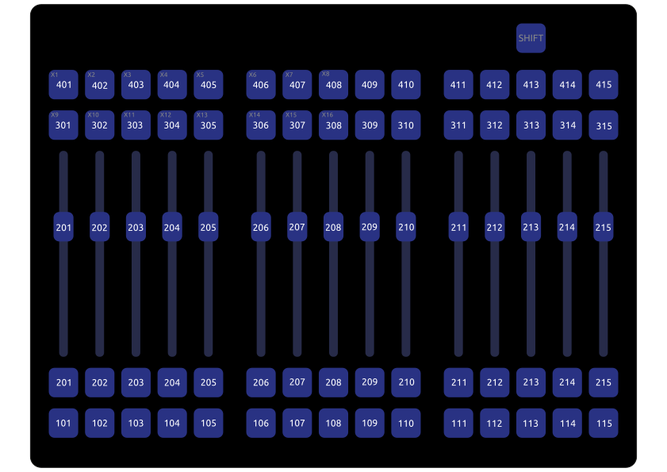
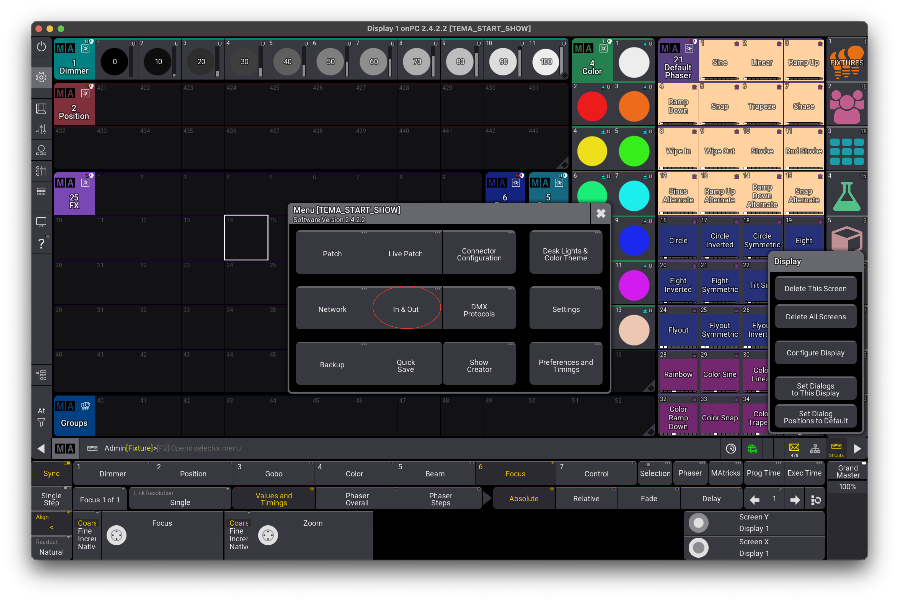
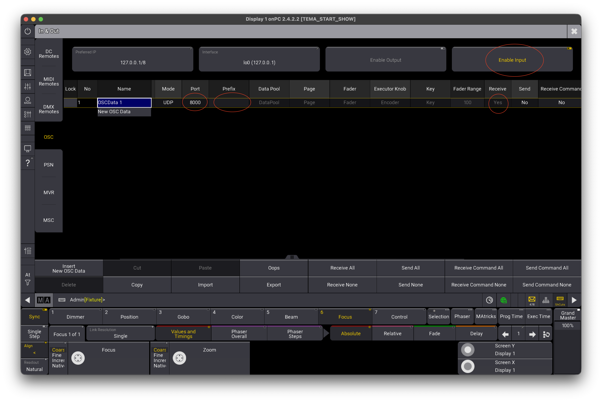

# Andy Roc Fader Wing to grandMA3

Утилита для конвертации MIDI-сигналов от Andy Roc Fader Wing в OSC поток для grandMA3.

> Для работы приложения крыло нужно запускать в миди-режиме:  
> зажимаем самую левую верхнюю кнопку с цифрой «1» и только после этого подаём
> питание на крыло.

- Работает только с grandMA3 on PC
- Это приложение и МА3 должны быть на одном компе
- Привязка экзекьюторов внутри МА3 к фейдерному крылу показана на
изображении выше и не меняется без правки исходного кода
- При зажатии кнопки SHIFT появляется доступ к X-кнопкам пульта
- Версия прошивки Andy Roc Fader Wing должна быть не ниже 3.0

> Сначала нужно подключить крыло в режиме MIDI-контроллера к компу и открыть МА3, 
> а только потом открывать это приложение! Если перезагружали МАшку или
> отключали/включали крыло, то это приложение нужно перезапустить.

## Включение OSC в grandMA3

## Скачать приложение

Правее от этого текста есть раздел «Релизы», там лежит версия
для MacOS (ARM) и Windows (X64). Если нужна версия под другую архитектуру - 
исходники перед вами в этом репозитории, можно собрать самостоятельно.

## Использование исходного кода

Исходный ход приложения опубликован в этом репозитории, с ним можно делать 
всё, что угодно. Если вы сделаете новый функционал приложения или исправите ошибку,
то присылайте пулл-реквест.

## Зависимости

- VolcanicArts.FastOSC (2.0.0)
- Melanchall.DryWetMidi (8.0.3)

---------------
Сделано в России в 2026 году